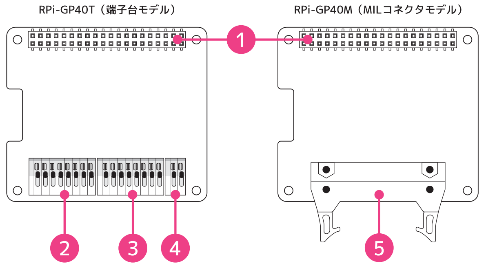
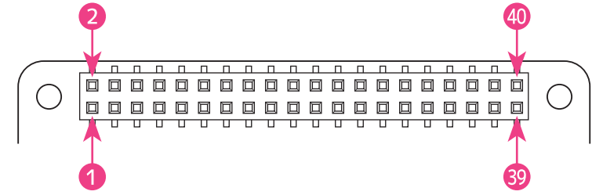
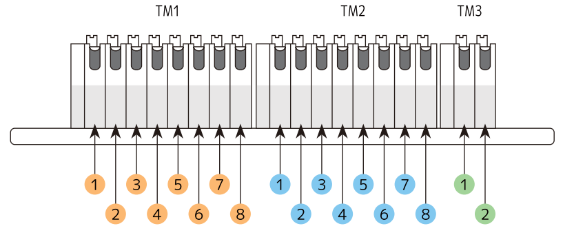
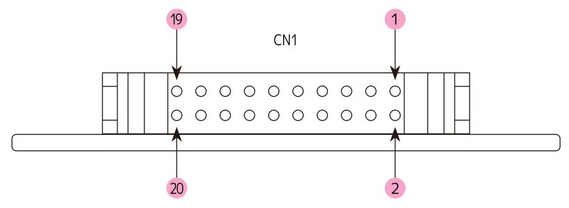

# RPi-GP40T / RPi-GP40M 各部名称と説明  
- RPi-GP40T: 端子台モデル  
- RPi-GP40M: MILコネクタモデル  
  
___  
## 1. 基板構成  
製品基板の各部名称は以下のとおりです。

  

| No | 名称 | 機能 |
|:-----:|:-----|-----|
|1|GPIO 40PINコネクタ|Raspberry Pi GPIO| 
|2|端子台 TM1 |アナログ入力端子(ch4～ch7)  ※RPi-GP40T|
|3|端子台 TM2 |アナログ入力端子(ch0～ch3)  ※RPi-GP40T|
|4|端子台 TM3 |デジタル出力端子 ※RPi-GP40T|
|5|MILコネクタ(20PIN) CN1 |アナログ入力8ch, デジタル入出力 ※RPi-GP40M|
___  
## 2. 各端子・コネクタについて  
### 2-1. GPIO 40PINコネクタ
GPIO 40 PIN の配列および使用ピンは以下のとおりです。   
  

40PIN GPIOのピン配列と説明 

| PIN# | 信号名 | 説明 | PIN# | 信号名 | 説明 |
|:---:|:---|:---|:---:|:---|:---|
|1|3.3V|3.3V電源|2|5V|5V電源|
|3|I2C SDA1/GPIO 2|(未使用)|4|5V|5V電源|
|5|I2C SCL1/GPIO 3|(未使用)|6|GND|GND|
|7|GPIO 4|(未使用)|8|GPIO 14|デジタル出力（オプション）|
|9|GND|GND|10|GPIO 15|デジタル/アラーム入力（オプション）|
|11|GPIO 17|(未使用)|12|GPIO 18|(未使用)|
|13|GPIO 27|絶縁電源制御|14|GND|GND|
|15|GPIO 22|(未使用)|16|GPIO 23|(未使用)|
|17|3.3V|3.3V電源|18|GPIO 24|(未使用)|
|19|SPI0 MOSI/GPIO 10|SPI_MOSI|20|GND|GND|
|21|SPI0 MISO/GPIO 9|SPI_MISO|22|GPIO 25|(未使用)|
|23|SPI0 SCLK/GPIO 11|SPI_SCLK|24|SPI CE0/GPIO 8|SPI_CE0|
|25|GND|GND|26|SPI CE1/GPIO 7|(未使用)|
|27|I2C SDA0/GPIO 0| HAT_ID読み込み用I2C |28|I2C SCL0/GPIO 1|HAT_ID読み込み用I2C|
|29|GPIO 5|(未使用)|30|GND|GND|
|31|GPIO 6|(未使用)|32|GPIO 12|デジタル出力（デフォルト）|
|33|GPIO 13|デジタル/アラーム入力（デフォルト）|34|GND|GND|
|35|GPIO 19|(未使用)|36|GPIO 16|(未使用)|
|37|GPIO 26|(未使用)|38|GPIO 20|(未使用)|
|39|GND|GND|40|GPIO 21|(未使用)|  

### 2-2. コネクタ配列 端子台モデル ※RPi-GP40T  
端子台モデル（RPi-GP40T）の端子配列は以下のとおりです。 

RPi-GP40T ピン配列と機能 

|TM#-PIN#|信号名|説明|
|:---:|:---|:---|
|TM3-2|DO|デジタル出力（オープンコレクタ）|
|TM3-1|DG|デジタルGND|
|TM2-8|A0|アナログ入力チャンネル0|
|TM2-7|G0|アナログ入力チャンネル0 GND|
|TM2-6|A1|アナログ入力チャンネル1|
|TM2-5|G1|アナログ入力チャンネル1 GND|
|TM2-4|A2|アナログ入力チャンネル2|
|TM2-3|G2|アナログ入力チャンネル2 GND|
|TM2-2|A3|アナログ入力チャンネル3|
|TM2-1|G3|アナログ入力チャンネル3 GND|
|TM1-8|A4|アナログ入力チャンネル4|
|TM1-7|G4|アナログ入力チャンネル4 GND|
|TM1-6|A5|アナログ入力チャンネル5|
|TM1-5|G5|アナログ入力チャンネル5 GND|
|TM1-4|A6|アナログ入力チャンネル6|
|TM1-3|G6|アナログ入力チャンネル6 GND|
|TM1-2|A7|アナログ入力チャンネル7|
|TM1-1|G7|アナログ入力チャンネル7 GND|

### 2-3. コネクタ配列 MILコネクタモデル ※RPi-GP40M  
MILコネクタモデル（RPi-GP40M）の端子配列は以下のとおりです。 

RPi-GP40M ピン配列と機能 

|CN1|信号名|説明|CN1|信号名|説明|
|:---:|:---|:---|:---:|:---|:---|
|1|DI|デジタル入力(シンク)|2|DG|デジタルGND|
|3|DO|デジタル出力(オープンコレクタ)|4|DG|デジタルGND|
|5|A0|アナログ入力チャンネル0|6|G0|アナログ入力チャンネル0 GND|
|7|A1|アナログ入力チャンネル1|8|G1|アナログ入力チャンネル1 GND|
|9|A2|アナログ入力チャンネル2|10|G2|アナログ入力チャンネル2 GND|
|11|A3|アナログ入力チャンネル3|12|G3|アナログ入力チャンネル3 GND|
|13|A4|アナログ入力チャンネル4|14|G4|アナログ入力チャンネル4 GND|
|15|A5|アナログ入力チャンネル5|16|G5|アナログ入力チャンネル5 GND|
|17|A6|アナログ入力チャンネル6|18|G6|アナログ入力チャンネル6 GND|
|19|A7|アナログ入力チャンネル7|20|G7|アナログ入力チャンネル7 GND|

___  

