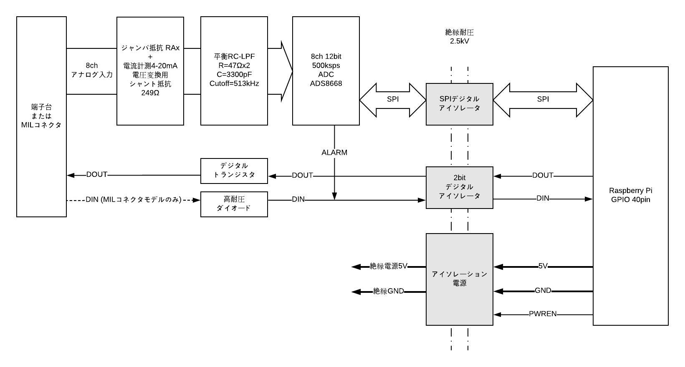
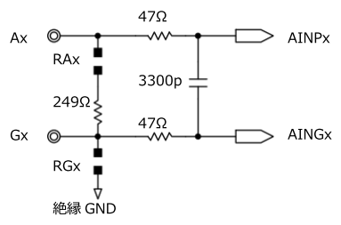
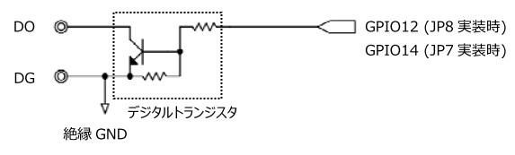
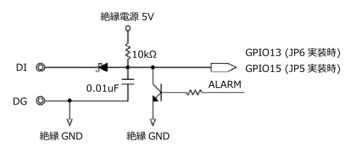

# RPi-GP40の機能と説明  
各インターフェースについて説明します。ブロック図は以下の通りです。  

  
  

___  
## 1. インターフェース  
### 1-1. Rapsberry Pi GPIO 40pin  
RPi-GP40を制御するために、GPIO 40pinの下記の信号を使用します。  
  
<u>制御信号</u>  
  
| PIN# | 名称 | 機能説明 |  
|:---:|:---|:---|  
|8|GPIO14|デジタル出力(オプション)   ※ジャンパ抵抗 JP7 実装時に有効　PIN# 32 参照|  
|10|GPIO15|デジタル/アラーム入力(オプション)    ※ジャンパ抵抗 JP5 実装時に有効　PIN#33  参照|  
|13|GPIO27|絶縁電源制御出力  1:ON / 0:OFF|  
|19|GPIO10/MOSI|SPI_MOSI ※ADS8668 制御に使用|  
|21|GPIO9/MISO|SPI_MISO ※ADS8668 制御に使用|  
|23|GPIO11/SCLK|SPI_SCLK ※ADS8668 制御に使用|  
|24|GPIO8/CE0|SPI_CE0 ※ADS8668 制御に使用|  
|27|GPIO0/ID_SD|HAT_ID読み込み用I2C|  
|28|GPIO1/ID_SC|HAT_ID読み込み用I2C|  
|32|GPIO12|デジタル出力(デフォルト)   ※ジャンパ抵抗 JP8 実装時に有効   オープンコレクタ出力 1:L, 0:オープン|  
|33|GPIO13|デジタル/アラーム入力(デフォルト)   ※ジャンパ抵抗 JP6 実装時に有効    要求  1:なし , 0:あり   デジタル入力：MIL コネクタモデルのみ  アラーム入力：ADS8668 の ALARM 通知機能   デジタル入力とアラーム入力はワイヤード OR|  

<u>電源端子</u>  
  
|PIN#|説明|  
|:--:|:--:|  
|1pin 17pin|3.3V|  
|2pin 4pin|5V|  
|6pin 9pin 14pin 20pin 25pin 30pin 34pin 39pin|GND|  
  
### 1-2. SPI  
TI製ADS8668 A/Dコンバータを制御するために使用します。  
  
<u>SPI動作モード</u>
  
以下の動作モードで使用してください。  
- SPI最大クロック周波数：17MHz  
- SPIモード：１　（CPOL=0, CPHA=1 クロック:正論理, 位相:H→L）  
  
<u>ADS8668 レジスタマップ</u>  
  
ADS8668のデータシートから「8.5レジスタマップ」などプログラム作成に必要な部分を抜粋し日本語翻訳したpdfです。  
https://github.com/ratocsystems/rpi-gp40/raw/master/datasheet/ads8668regj.pdf  

<u>ADS8668 製品情報</u>  
  
最新の情報や機能詳細についてはTexas Instruments社のADS8668製品情報を参照してください。  
http://www.tij.co.jp/product/jp/ADS8668  
 
  
### 1-3. アナログ入力  
  
アナログ入力部は上図のような回路構成です。  
- Ax(A0-A7): アナログ入力チャンネル0-7  
    > 電圧入力レンジ: ±10V, ±5V, ±2.5V, ±1V, ±0.5V, 0-10V, 0-5V, 0-2.5V, 0-1V  
    > ソフトウェアでチャンネルごとに電圧入力レンジを切り替え可能です。  
    > 入力インピーダンスは1MΩで、いずれの電圧入力レンジ設定でも一定です。  
    > ジャンパ抵抗 RAx で 4-20mA電流計測も可能です。  
- Gx(G0-G7): アナログ入力GND  
    > アナログ入力のGND側です。  
    > 各チャンネル間のGNDは RGx を通して絶縁GNDに接続されます。  
- RAx: 電流測定ジャンパ抵抗  
    > RAxにジャンパ抵抗を実装することで、4-20mAを1-5V電圧変換するシャント抵抗249Ωを有効化できます。デフォルトはオープンです。  
- RGx: GNDジャンパ抵抗  
    > デフォルトはRGxジャンパ抵抗が実装されていて、シングルエンド入力に設定されています。  
    > RGxをオープンにすると差動入力となりますが、ADS8668はシングルエンド専用ですので、オープンで使用しないでください。  
- 平衡ローパスフィルタ  
    > アナログ入力端子とADコンバータ間にカットオフ周波数513kHzの平衡ローパスフィルタがあります。  
    > f=1/(2πx47Ωx2x3300p)=513kHz  
 
### 1-4. デジタル出力  
  
デジタル出力部は上図のような回路構成です。  
- DO: デジタル出力  
    > オープンコレクタ出力です。  
    > 最大定格はOFF時30V、ON時50mA/200mWです。  
    > ジャンパ抵抗JP8/JP7で、GPIOを12または14へ切替えることが可能です。  
    > デフォルトはJP8が実装されていてGPIO12へ接続されています。  
- DG: デジタルGND  
    > デジタル出力のGNDです。絶縁GNDに接続されています。  
  
### 1-5. デジタル入力とアラーム機能  
  
デジタル入力部は上図のような回路構成です。  
- DI: デジタル入力  
    > 絶縁電源5Vに10kΩでプルアップされたTTLレベル入力方式です。  
    > VIH=2.0V, VIL=0.8Vで耐圧30Vです。  
    > 端子台モデルはデジタル入力機能を持っていません。  
    > ジャンパ抵抗JP6/JP5で、GPIOを13または15へ切替えることが可能です。  
    > デフォルトはJP6が実装されていてGPIO13へ接続されています。  
    > ADS8668のアラーム出力がワイヤードオアされています。  
- DG: デジタルGND  
    > デジタル入力のGNDです。絶縁GNDに接続されています。  

### 1-6. 絶縁電源制御出力  
PWREN信号(GPIO27)は絶縁電源5VのON/OFFを制御します。  
- PWREN: 絶縁電源制御出力  
    > 絶縁電源5V High:ON Low:OFF  
- ADS8668 A/DコンバータなどGPIO 40pinから絶縁された回路用電源を制御します。  
    > アナログ入力・デジタル入出力の制御を行う前に、絶縁電源5VをONにしてください。  
    > 絶縁電源5VをOFFにすると、ADS8668のレジスタ内容は初期値にリセットされます。  

___  
  
