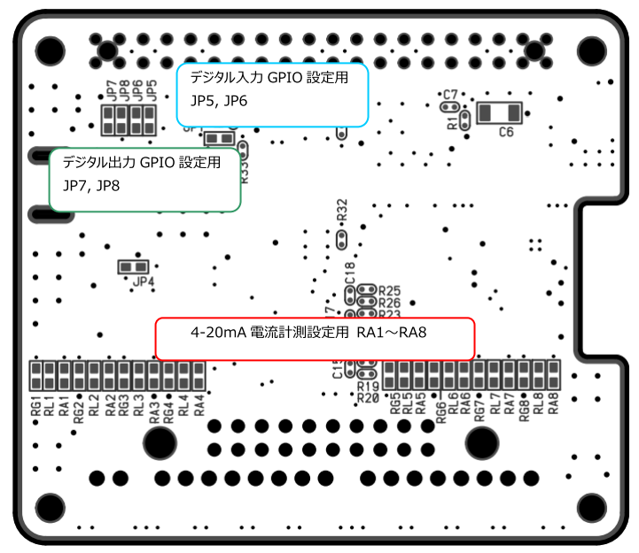
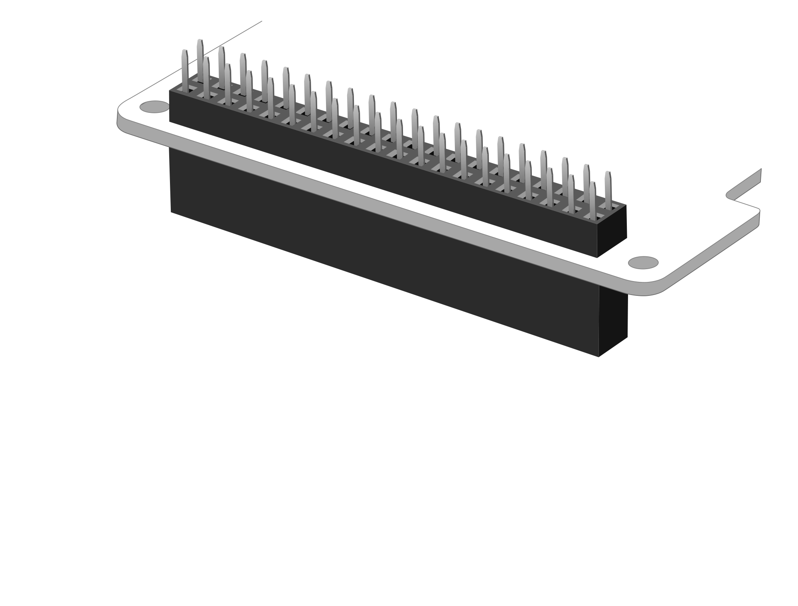
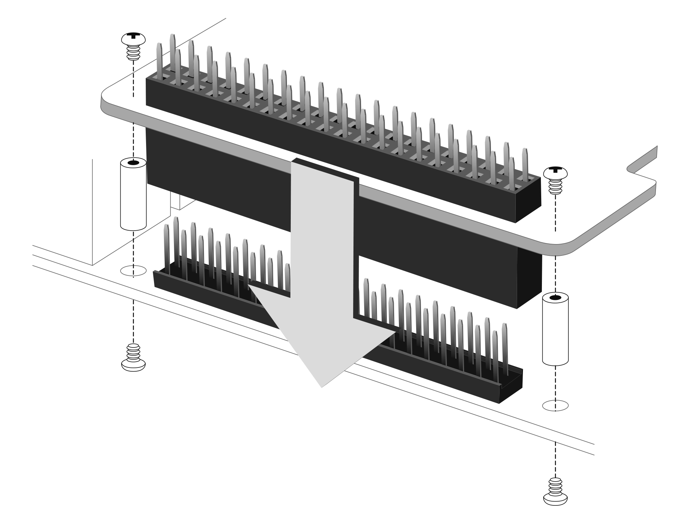

# RPi-GP40の設定と装着  
各種設定と本製品をRaspberry Pi GPIO 40PINに接続する方法を説明します。  

___  
## 1. 各種設定  
  
### 1-1. アラーム入力/デジタル入力(MILコネクタモデルのみ)用GPIOの設定  
アラーム/デジタル入力用GPIOの初期設定は`GPIO13`ですが、`JP6`を未実装にし`JP5`に0ohm/1608サイズの抵抗を実装することによって`GPIO15`に変更することができます。  
  
### 1-2. デジタル出力制御用GPIOの設定  
ストローブ出力制御用GPIOの初期設定は`GPIO12`ですが、`JP8`を未実装にし`JP7`に0ohm/1608サイズの抵抗を実装することによって`GPIO14`に変更することができます。  

### 1-3. 4-20mA電流計測用シャント抵抗の設定  
アナログ入力チャンネル0～7に対応した`RA1～RA8`に0ohm/1608サイズの抵抗を実装することによって、4-20mAを1-5Vに変換するシャント抵抗249Ωを有効化できます。

___  
## 2. 本体の組み立て  
製品付属の40PIN ピンヘッダーを本製品の底面より垂直に装着します。  
※40PINのピンヘッダーの先端は尖っていますので、怪我には十分ご注意ください。  

  

  

## 3. Raspberry Piボードとの接続  
Raspberry Pi 本体のGPIO ピンヘッダと本製品を接続します。  
スペーサー（付属）を本製品本体のネジ穴にあわせ、スペーサーを付
属のネジ（4 本）で固定し、そのままRaspberryPi のGPIO ピンへ垂
直に差し込みます。  
スペーサーがRaspberryPi 基板に合わされば接続は完了です。  
あとはRaspberryPi の背面より付属のネジ（4 本）を使用し、スペーサーを固定します。    
※反対側にも同じようにスペーサーとネジを使用し本体を固定してください。  

  
